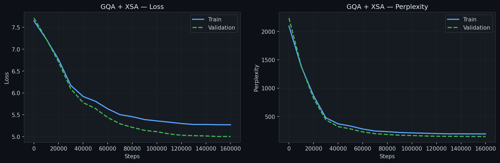
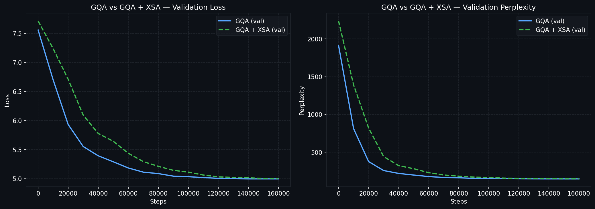

# LLM Attention Variants

A from-scratch implementation of a small language model used as a testbed for comparing modern attention variants. The goal is to measure the effect of **Exclusive Self-Attention (XSA)** against standard attention, under both multi-head and grouped-query configurations, using identical training conditions.

---

## Motivation

This project extends a previous [GPT-2 modernisation](https://github.com/lealal/gpt_2-update) that already incorporated RMSNorm, RoPE, and Grouped Query Attention (GQA). Here the focus shifts to a newer proposal — **XSA** ([Exclusive Self-Attention, 2025](https://arxiv.org/pdf/2603.09078)) — which argues that standard attention over-weights information already captured from the current token. XSA removes this redundancy by projecting the context vector onto the subspace orthogonal to the current token's value vector, forcing the model to attend exclusively to *other* tokens.

---

## Planned Experiments

| Run | Attention | Status |
|-----|-----------|--------|
| `gqa-xsa` | GQA + XSA | ✅ Trained |
| `gqa` | GQA (baseline) | ✅ Trained |
| `mha` | Multi-Head Attention | 🔜 Next |
| `mha-xsa` | Multi-Head Attention + XSA | 📋 Planned |

---

## Architecture

All models share the same backbone; only the attention module changes between runs.

| Hyperparameter | Value |
|----------------|-------|
| Vocabulary | GPT-2 (50 257 tokens) |
| Context length | 512 |
| Embedding dim | 768 |
| Layers | 13 |
| Attention heads | 8 |
| KV groups (GQA) | 4 |
| MLP hidden dim | 2 048 |
| dtype | `bfloat16` |
| Dataset | RedPajama |

**Components:**
- **RMSNorm** — pre-norm on both attention and MLP sub-layers
- **RoPE** — rotary positional embeddings applied to Q and K after QK-norm
- **QK-Norm** — per-head RMSNorm on queries and keys for training stability
- **SwiGLU MLP** — gated activation with two parallel projections
- **KV Cache** — incremental decoding cache for efficient inference
- **Weight tying** — embedding and output projection share weights

### XSA

After computing the standard scaled dot-product attention output $\mathbf{c}$, XSA subtracts the component parallel to the current token's (normalised) value vector $\hat{\mathbf{v}}$:

$$\mathbf{c}' = \mathbf{c} - (\mathbf{c} \cdot \hat{\mathbf{v}})\,\hat{\mathbf{v}}$$

This keeps only the part of the context vector that is orthogonal to the token's own value representation, ensuring the attention output carries no redundant self-information.

---

## Training Setup

| Setting | Value |
|---------|-------|
| Epochs | 1 |
| Batch size | 8 |
| Gradient accumulation | 2 steps (effective batch 16) |
| Optimiser | AdamW (fused) |
| Peak LR | 4 × 10⁻⁴ |
| Min LR | 4 × 10⁻⁵ |
| Warmup | 5 % of total steps |
| LR schedule | Cosine decay after warmup |
| Gradient clipping | 1.0 |
| Evaluation frequency | Every 10 000 steps |

---

## Results

### GQA + XSA



| Metric | Final Train | Final Val |
|--------|-------------|-----------|
| Loss | 5.27 | 5.00 |
| Perplexity | ~195 | ~149 |

### GQA (baseline)

| Metric | Final Val |
|--------|-----------|
| Loss | ~5.00 |

### GQA vs GQA + XSA



Both configurations converge to a similar final validation loss (~5.00) over 160 000 steps. GQA (baseline) converges noticeably faster — reaching near-final loss around step 80 000 — while GQA + XSA takes roughly 120 000–130 000 steps to reach the same level. This suggests XSA slows convergence at this scale without a measurable accuracy benefit, though more training steps or a larger model may tell a different story.

---

## Repository Structure

```
gqa-xsa.ipynb          # GQA + XSA training notebook
gqa-xsa-metrics.json   # Logged losses and perplexities
gqa-xsa.pth            # Saved checkpoint
gqa.ipynb              # GQA baseline training notebook
gqa-metrics.json       # Logged losses and perplexities
gqa.pth                # Saved checkpoint
llm_module.py          # Shared model, training, and generation code
assets/                # Charts and figures
```

---

## References

- [Exclusive Self-Attention (XSA)](https://arxiv.org/pdf/2603.09078)
- [GQA: Training Generalized Multi-Query Transformer Models from Multi-Head Checkpoints](https://arxiv.org/abs/2305.13245)
- [RoFormer: Enhanced Transformer with Rotary Position Embedding](https://arxiv.org/abs/2104.09864)
- [Root Mean Square Layer Normalization](https://arxiv.org/abs/1910.07467)
